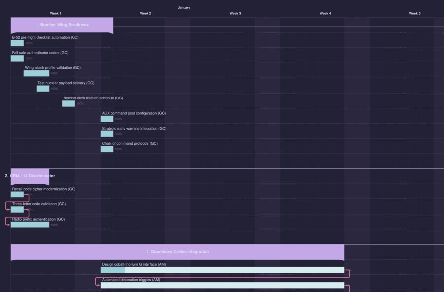

# project-tracking

Gantt charts as code. Each project gets a standalone LaTeX PDF — versioned, reproducible, and dark-themed with [Rose Pine Moon](https://rosepinetheme.com).

Built on `pgfgantt` + LuaLaTeX. Outputs pixel-perfect PDFs that look good on screen and in print.

---

[](assets/example.pdf)

## What's in here

| Chart | File | Description |
|---|---|---|
| Plan R | `planr.tex` | Nuclear strike capability enhancement |
| Wing Attack Plan | `wing-attack-plan.tex` | RADCaST SEU detection software sprint |
| Operation Dropkick | `operation-dropkick.tex` | Presidential briefing pipeline |
| Precious Bodily Fluids | `precious-bodily-fluids.tex` | Personal schedule — festivals, DEFCON, moves |
| Test Plan | `testplan.tex` | Radiation effects test plan (IEEE 829-style) |

Charts live in `Charts/`. Each root `.tex` file sets the date range and pulls in the corresponding chart content.

---

## Requirements

- LuaLaTeX (TeX Live 2023+ or MiKTeX)
- `latexmk`
- `pgfgantt`, `pgfcalendar`, `xcolor`, `datetime2`, `fontspec`, `etoolbox`
- TeX Gyre Heros font (included in TeX Live)

---

## Build

```sh
make charts        # build all charts → output/
make pdf           # build planr.pdf only
make watch         # rebuild planr on save (Ctrl+C to stop)
make clean         # remove build artifacts
make distclean     # remove build artifacts + output PDFs
```

PDFs land in `output/`. Build artifacts go to `build/` and are ignored by git.

---

## Project layout

```
.
├── Makefile
├── .latexmkrc
├── planr.tex                  # entry points — set date range, pull in chart
├── wing-attack-plan.tex
├── operation-dropkick.tex
├── precious-bodily-fluids.tex
├── Charts/
│   ├── PlanR.tex              # ganttchart environment — tasks, groups, links
│   ├── WingAttackPlan.tex
│   ├── OperationDropkick.tex
│   ├── PreciousBodilyFluids.tex
│   └── TestPlan.tex
└── Settings/
    ├── preamble.tex           # packages and shared macros
    ├── colors.tex             # Rose Pine Moon palette
    ├── fonts.tex              # TeX Gyre Heros via fontspec
    └── ganttconfig.tex        # pgfgantt defaults, weekend shading, alternating rows
```

---

## Adding a chart

**1.** Create `Charts/MyProject.tex`:

```latex
\begin{ganttchart}{\chartstart}{\chartend}

\gantttitlecalendar{month=name, week} \\

\ganttgroup{Phase One}{2026-01-05}{2026-02-28} \\
\assignedtask{First task}{2026-01-05}{2026-01-15}{50}{DL}[t1] \\
\assignedtask{Second task}{2026-01-16}{2026-02-28}{0}{DL}[t2] \\
\ganttlink{t1}{t2}

\end{ganttchart}
```

**2.** Create the entry point `myproject.tex`:

```latex
\documentclass[tikz]{standalone}
\input{Settings/preamble}
\input{Settings/colors}
\input{Settings/fonts}
\input{Settings/ganttconfig}

\edef\chartstart{2026-01-05}
\edef\chartend{2026-06-30}

\begin{document}
\input{Charts/MyProject}
\end{document}
```

**3.** Add `myproject` to `CHARTS` in the Makefile.

---

## Task macros

```latex
% Assigned task — shows progress bar + assignee initials
\assignedtask{Task name}{start}{end}{progress%}{Initials}[task-id]

% Group header
\ganttgroup{Phase Name}{start}{end} \\

% Dependency arrow
\ganttlink[link type=f-s]{from-id}{to-id}

% Milestone diamond
\ganttmilestone{Name}{date} \\

% Vertical rule (deadline, event)
\ganttvrule{DEADLINE}{date}

% Section divider line
\sectionsep
```

`[task-id]` is optional but required if you want to draw dependency links to or from the task. Dates are ISO 8601 (`YYYY-MM-DD`). Progress is `0`–`100`.

Link types: `f-s` (finish-to-start), `s-s` (start-to-start), `f-f` (finish-to-finish).

---

## Theme

Rose Pine Moon — full palette defined in `Settings/colors.tex`.

| Role | Color | Hex |
|---|---|---|
| Background | `base` | `#232136` |
| Task bars | `foam` | `#9ccfd8` |
| Groups | `iris` | `#c4a7e7` |
| Links | `love` | `#eb6f92` |
| Today line | `gold` | `#f6c177` |
| Text | `text` | `#e0def4` |

---

## License

[MIT](LICENSE)
